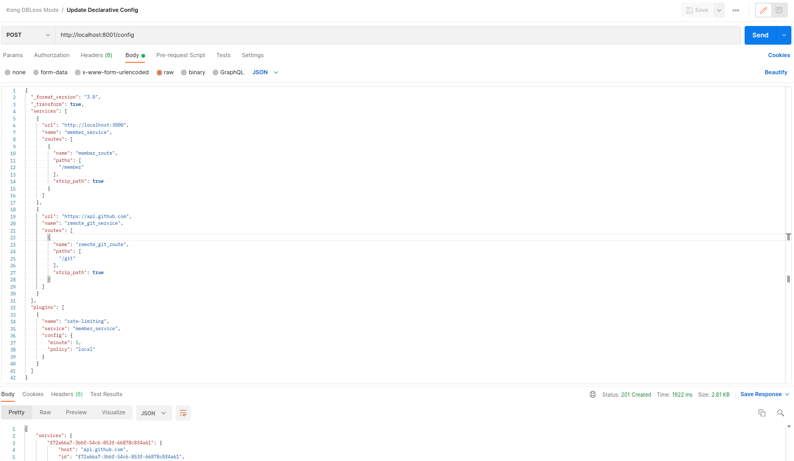

# Kong Gateway in DB-less mode Guideline

This guide provides steps to run **Kong Gateway** with Docker without a database (DB-less mode). It'll specific to proxying REST Request (from client) to REST Upstream Service

## Prerequisites
To completely run this guide, you need to ensure some things:
- [Docker](https://docs.docker.com/engine/install/ubuntu/) is installed in your machine.
- [nodejs](https://nodejs.org/en/download/) and [npm](https://docs.npmjs.com/cli/v9) installed.
- OS: Ubuntu 20.04 (this guide created in Ubuntu 20.04 Environment, of you using other OS  then it needs some command adjustments)

## Run Kong Gateway
### 1. Run simple REST Service. 

This is optional step, if you already have REST app running in server. Then you can skip this one.

This repo already provide simple REST Service, just open terminal in `member-app` folder, and run command 
```shell
npm install && node index.js
```
The simple REST app should be run on Port 3000.

### 2. Prepare your declarative configuration file in .yml or .json format. 

The Kong declarative configuration file consists of lists of Kong entities and their attributes. Add whatever core entities (Services, Routes, Plugins, Upstreams, etc) you need to this file.

For example, a simple configuration file with a Service and a Route may look something like this:
```yml
 _format_version: "3.0"
 _transform: true

 services:
 - url: http://172.17.0.1:3000
   name: member_service
   routes:
   - name: member_route
     paths:
     - /member
     strip_path: true
```
The file already provided in this repo with name [`kong.yml`](./kong.yml).

You can change `services.url` value with your own REST app URL. In this guide, we use simple REST app that deployed in the previous step.

See the [declarative configuration schema](https://github.com/Kong/deck/blob/main/file/kong_json_schema.json) for all configuration options.

### 3. Run Kong Gateway container

From the same directory where `kong.yml` take place, run the following command (in new terminal) to start Kong Gateway container:
```sh
./run-kong.sh
```
The content of  [`run-kong.sh`](./run-kong.sh) file is:
```sh
#!/bin/bash

docker run -d --name kong-dbless \
  --network=host \
  -v "$(pwd):/kong/declarative/" \
  -e "KONG_DATABASE=off" \
  -e "KONG_DECLARATIVE_CONFIG=/kong/declarative/kong.yml" \
  -e "KONG_PROXY_ACCESS_LOG=/dev/stdout" \
  -e "KONG_ADMIN_ACCESS_LOG=/dev/stdout" \
  -e "KONG_PROXY_ERROR_LOG=/dev/stderr" \
  -e "KONG_ADMIN_ERROR_LOG=/dev/stderr" \
  -e "KONG_ADMIN_LISTEN=0.0.0.0:8001" \
  kong/kong-gateway:3.1.1.1
```
Where:

- `--name` and `--network`: The name of the container to create, and the Docker network it communicates on.
- `-v $(pwd):/path/to/target/`: Mount the current directory on your local filesystem to a directory in the Docker container. This makes the `kong.yml` file visible from the Docker container.
- `KONG_DATABASE`: Sets the database to `off` to tell Kong not to use any backing database for configuration storage.
- `KONG_DECLARATIVE_CONFIG`: The path to a declarative configuration file inside the container. This path **should match the target path** that you’re mapping with -v.
- `All _LOG` parameters: set filepaths for the logs to output to, or use the values in the example to print messages and errors to stdout and stderr.
- `KONG_ADMIN_LISTEN`: The port that the Kong Admin API listens on for requests.

*Note: we use --network=host because the example run on the host network (Kong in docker need access to 'localhost of host'). If the REST server available externally (using DNS or IP address), we can omit --network=host and use port bindings instead. See [run-kong-bridge.sh](./run-kong-bridge.sh) for example*

### 4. Verify that Kong Gateway is running

Verify that Kong Gateway is running by run command:
```sh
curl http://localhost:8001
```

Or you can check list of Service
```sh
curl http://localhost:8001/services
```

The response may looks like:
```json
{
  "next": null,
  "data": [
    {
      "path": null,
      "tls_verify_depth": null,
      "host": "172.17.0.1",
      "tags": null,
      "ca_certificates": null,
      "id": "ce525a6f-659d-5766-a156-0e204709ac8a",
      "retries": 5,
      "updated_at": 1674730862,
      "port": 3000,
      "protocol": "http",
      "client_certificate": null,
      "tls_verify": null,
      "write_timeout": 60000,
      "created_at": 1674730862,
      "enabled": true,
      "connect_timeout": 60000,
      "name": "member_service",
      "read_timeout": 60000
    }
  ]
}
```

### 5. Kong Deployment is Finish! Make sure it is working

Now, you can test the Kong Gateway with registered Service and Route, below is the example request:
```sh
curl http://localhost:8000/member/api/v1/members
```

The response may looks like:
```json
{
  "members": [
    {
      "name": "dino",
      "place": "jakarta"
    },
    {
      "name": "doni",
      "place": "bandung"
    }
  ]
}
```

Lets try other endpoint and method:
```sh
curl -X POST -H 'Content-Type: application/json' -d '{"name": "Tcala", "place": "Wakanda"}' http://localhost:8000/member/api/v1/members
```

The response may looks like:
```json
{
  "data": {
    "name": "Tcala",
    "place": "Wakanda"
  }
}
```

## Update Kong Gateway Configuration
In case when Kong Gateway is up and running, we can update configuration by Kong Admin API, using `/config` endpoint. 

**Note: The `/config` endpoint replaces the entire set of entities in memory with the ones specified in the given file.*

From the previous steps, we already have the runnning Kong Gateway. Let say we want to update the configuration with details:
- Add Github API Service (remote service) and it's Route
- Apply **rate-limiting** plugin

Todo do that, we need to convert [`kong.yml`](./kong.yml) to JSON format. We can use [yaml tools](https://onlineyamltools.com/convert-yaml-to-json) to convert yml/yaml to JSON. The result is below:

```json
{
  "_format_version": "3.0",
  "_transform": true,
  "services": [
    {
      "url": "http://172.17.0.1:3000",
      "name": "member_service",
      "routes": [
        {
          "name": "member_route",
          "paths": [
            "/member"
          ],
          "strip_path": true
        }
      ]
    }
  ]
}
```

Then, add Github API Service and Route, also apply **rate limiting** plugin. The configuration become:

```json
{
  "_format_version": "3.0",
  "_transform": true,
  "services": [
    {
      "url": "http://172.17.0.1:3000",
      "name": "member_service",
      "routes": [
        {
          "name": "member_route",
          "paths": [
            "/member"
          ],
          "strip_path": true
        }
      ]
    },
    {
      "url": "https://api.github.com",
      "name": "remote_git_service",
      "routes": [
        {
          "name": "remote_git_route",
          "paths": [
            "/git"
          ],
          "strip_path": true
        }
      ]
    }
  ],
  "plugins": [
    {
      "name": "rate-limiting",
      "service": "member_service",
      "config": {
        "minute": 5,
        "policy": "local"
      }
    }
  ]
}
```

Send the configuration above to Kong `/config` endpoint


Configuration update is complete. Now, You can test that the new configuration whether applied properly or not.

Invoke Github Service from Kong Gateway:
```sh
curl http://localhost:8000/git
```
It should be responses with http 200 and long payload.

To check **rate-limiting** plugin is working, we can invoke Member Service (`curl http://localhost:8000/member`) more than 5 times in a minute. At 6th invocation, it will response with:
```json
{
  "message": "API rate limit exceeded"
}
```
It is indicates that our plugin is working.


## Destroy Kong Gateway Container
If you’re done testing Kong Gateway and no longer need the containers, you can clean them up using the following commands:
```sh
docker stop kong-dbless && docker container rm kong-dbless
```