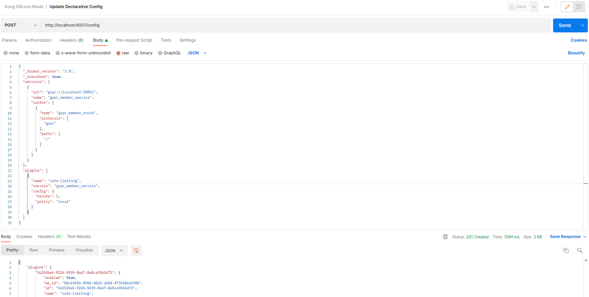

# Kong Gateway in DB-less mode Guideline

This guide provides steps to run **Kong Gateway** with Docker without a database (DB-less mode). It'll specific to proxying gRPC Request (from client) to gRPC Upstream Service.

## Prerequisites
To completely run this guide, you need to ensure some things:
- Familiar with [gRPC](https://grpc.io/)
- [grpcurl](https://github.com/fullstorydev/grpcurl) installed
- [Docker](https://docs.docker.com/engine/install/ubuntu/) is installed in your machine.
- [nodejs](https://nodejs.org/en/download/) and [npm](https://docs.npmjs.com/cli/v9) installed.
- OS: Ubuntu 20.04 (this guide created in Ubuntu 20.04 Environment, of you using other OS  then it needs some command adjustments)

This guide writen based on [official docs](https://docs.konghq.com/gateway/3.1.x/kong-plugins/configuring-a-grpc-service/).

## Run Kong Gateway
Starting with version 1.3, gRPC proxying is natively supported in Kong Gateway. In this section, you’ll guided to configure Kong Gateway to manage your gRPC services.

In Kong 1.3, gRPC support assumes gRPC over HTTP/2 framing. As such, make sure you have at least one HTTP/2 proxy listener (check out the [Configuration Reference](https://docs.konghq.com/gateway/3.1.x/reference/configuration/) for how to). In this guide, we will assume Kong is listening for HTTP/2 proxy requests on port 9080.

### 1. Run simple gRPC Service. 

This is optional step, if you already have gRPC app running in server. Then you can skip this one.

This repo already provide simple gRPC Service, just open terminal in `member-app-grpc` folder, and run command: 
```shell
npm install && node grpc-server.js
```
The simple gRPC app should be run on Port 50051.

### 2. Prepare your declarative configuration file in .yml or .json format. 

The Kong declarative configuration file consists of lists of Kong entities and their attributes. Add whatever core entities (Services, Routes, Plugins, Upstreams, etc) you need to this file.

For example, a simple configuration file with a gRPC Service and a Route may look something like this:
```yml
 _format_version: "3.0"
 _transform: true

 services:
 - url: grpc://localhost:50051
   name: grpc_member_service
   routes:
   - name: grpc_member_route
     protocols: 
     - grpc
     paths:
     - /
```
The file already provided in this repo with name `kong-grpc.yml`.

You can change `services.url` value with your own gRPC app URL. In this guide, we use simple gRPC app that deployed in the previous step.

See the [declarative configuration schema](https://github.com/Kong/deck/blob/main/file/kong_json_schema.json) for all configuration options.

### 3. Run Kong Gateway container

From the same directory where `kong-grpc.yml` take place, run the following command (in new terminal) to start Kong Gateway container:
```sh
./run-kong-grpc.sh
```
The content of  [`run-kong-grpc.sh`](./run-kong-grpc.sh) file is:
```sh
#!/bin/bash

docker run -d --name kong-dbless \
  --network=host \
  -v "$(pwd):/kong/declarative/" \
  -e "KONG_DATABASE=off" \
  -e "KONG_DECLARATIVE_CONFIG=/kong/declarative/kong-grpc.yml" \
  -e "KONG_PROXY_ACCESS_LOG=/dev/stdout" \
  -e "KONG_ADMIN_ACCESS_LOG=/dev/stdout" \
  -e "KONG_PROXY_ERROR_LOG=/dev/stderr" \
  -e "KONG_ADMIN_ERROR_LOG=/dev/stderr" \
  -e "KONG_ADMIN_LISTEN=0.0.0.0:8001" \
  -e "KONG_PROXY_LISTEN=0.0.0.0:8000, 0.0.0.0:8443, 0.0.0.0:9080 http2, 0.0.0.0:9081 http2 ssl" \
  kong/kong-gateway:3.1.1.1
```
Where:

- `--name` and `--network`: The name of the container to create, and the Docker network it communicates on.
- `-v $(pwd):/path/to/target/`: Mount the current directory on your local filesystem to a directory in the Docker container. This makes the `kong.yml` file visible from the Docker container.
- `KONG_DATABASE`: Sets the database to `off` to tell Kong not to use any backing database for configuration storage.
- `KONG_DECLARATIVE_CONFIG`: The path to a declarative configuration file inside the container. This path **should match the target path** that you’re mapping with -v.
- `All _LOG` parameters: set filepaths for the logs to output to, or use the values in the example to print messages and errors to stdout and stderr.
- `KONG_ADMIN_LISTEN`: The port that the Kong Admin API listens on for requests.
- `KONG_PROXY_LISTEN`: Comma-separated list of addresses and ports on which the proxy server should listen for HTTP/HTTPS traffic.

As we can see at `KONG_PROXY_LISTEN`, there are ports (9080 and 9081) dedicated for http2, that ports will use for gRPC communication.

*Note: we use --network=host because the example run on the host network (Kong in docker need access to 'localhost of host'). If the grpc server available externally (using DNS or IP address), we can omit --network=host and use port bindings instead. See [run-kong-grpc-bridge.sh](./run-kong-grpc-bridge.sh) for example*

### 4. Verify that Kong Gateway is running

Verify that Kong Gateway is running by run command:
```sh
curl http://localhost:8001
```

Or you can check list of Service
```sh
curl http://localhost:8001/services
```

The response may looks like:
```json
{
  "data": [
    {
      "host": "localhost",
      "write_timeout": 60000,
      "id": "10a111b0-43e4-572e-b154-0f0a3537a743",
      "name": "grpc_member_service",
      "retries": 5,
      "tls_verify_depth": null,
      "path": null,
      "port": 50051,
      "client_certificate": null,
      "updated_at": 1674748855,
      "tls_verify": null,
      "protocol": "grpc",
      "enabled": true,
      "connect_timeout": 60000,
      "created_at": 1674748855,
      "read_timeout": 60000,
      "tags": null,
      "ca_certificates": null
    }
  ],
  "next": null
}
```

### 5. Kong Deployment is Finish! Make sure it is working

Now, you can test the Kong Gateway with registered Service and Route, below is the example gRPC request with grpcurl:
```sh
grpcurl -plaintext -import-path $path/member-app-grpc -proto member.proto localhost:9080 member.MemberService/GetAllMembers
```
*note: replace $path with absolute path to this project (run `pwd` command)*

The response may looks like:
```json
{
  "members": [
    {
      "id": "1",
      "name": "Dinokey",
      "place": "Jakarta",
      "hobby": "Sleep"
    },
    {
      "id": "2",
      "name": "John Doe",
      "place": "Malang",
      "hobby": "Running"
    }
  ]
}
```

Lets try other gRPC endpoint and method:
```sh
grpcurl -d '{"id": "", "name": "Tcala", "place": "Wakanda", "hobby": "Running"}' -plaintext $path/member-app-grpc -proto member.proto localhost:9080 member.MemberService/AddMember
```

The response may looks like:
```json
{
  "members": [
    {
      "id": "1",
      "name": "Dinokey",
      "place": "Jakarta",
      "hobby": "Sleep"
    },
    {
      "id": "2",
      "name": "John Doe",
      "place": "Malang",
      "hobby": "Running"
    },
    {
      "id": "1674751635735",
      "name": "Tcala",
      "place": "Wakanda",
      "hobby": "Running"
    }
  ]
}
```

## Update Kong Gateway Configuration
In case when Kong Gateway is up and running, we can update configuration by Kong Admin API, using `/config` endpoint. 

**Note: The `/config` endpoint replaces the entire set of entities in memory with the ones specified in the given file.*

From the previous steps, we already have the runnning Kong Gateway. Let say we want to update the configuration with details:
- Change route path from `/` to `/member.MemberService/GetAllMembers`
- Add new route with path `/member.MemberService/DeleteMember`

Todo do that, we need to convert `kong-grpc.yml` to JSON format. We can use [yaml tools](https://onlineyamltools.com/convert-yaml-to-json) to convert yml/yaml to JSON. The result is below:

```json
{
  "_format_version": "3.0",
  "_transform": true,
  "services": [
    {
      "url": "grpc://172.17.0.1:50051",
      "name": "grpc_member_service",
      "routes": [
        {
          "name": "grpc_member_route",
          "protocols": [
            "grpc"
          ],
          "paths": [
            "/"
          ]
        }
      ]
    }
  ]
}
```

Then, modify existing route and add new route. The configuration become:

```json
{
  "_format_version": "3.0",
  "_transform": true,
  "services": [
    {
      "url": "grpc://172.17.0.1:50051",
      "name": "grpc_member_service",
      "routes": [
        {
          "name": "grpc_member_route",
          "protocols": [
            "grpc"
          ],
          "paths": [
            "/member.MemberService/GetAllMembers"
          ]
        },
        {
          "name": "grpc_member_route_2",
          "protocols": [
            "grpc"
          ],
          "paths": [
            "/member.MemberService/DeleteMember"
          ]
        }
      ]
    }
  ]
}
```

Send the configuration above to Kong `/config` endpoint


Configuration updates is complete. Now, You can test that the new configuration whether applied properly or not.

Check routes, it should be 2 route:
```sh
curl http://localhost:8001/routes
```

Then, try to invoke AddMember gRPC method:
```sh
grpcurl -d '{"id": "", "name": "Tcaka", "place": "Wakanda", "hobby": "Swimming"}' -plaintext -import-path $path/member-app-grpc -proto member.proto localhost:9080 member.MemberService/AddMember
```

It should be error, because no routes match with that request.
```
ERROR:
  Code: Unimplemented
  Message: unexpected HTTP status code received from server: 404 (Not Found); malformed header: missing HTTP content-type
```

## Destroy Kong Gateway Container
If you’re done testing Kong Gateway and no longer need the containers, you can clean them up using the following commands:
```sh
docker stop kong-dbless && docker container rm kong-dbless
```